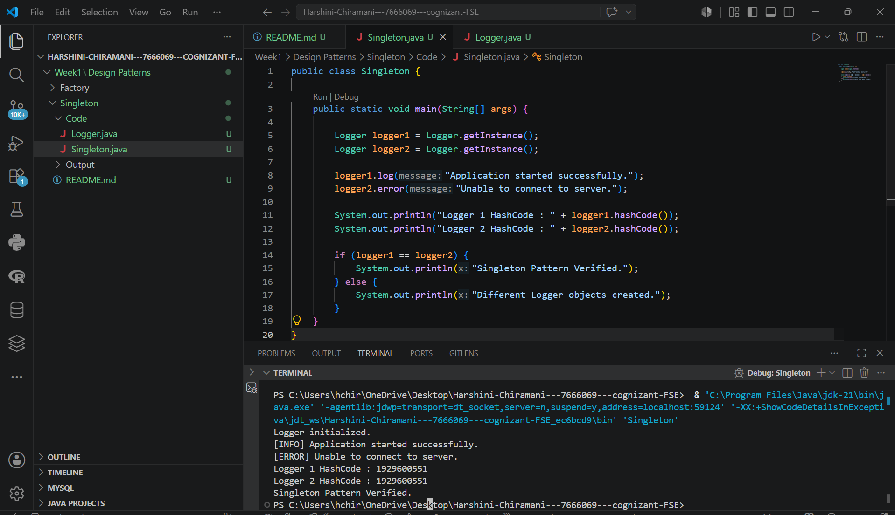

# Exercise 1: Implementing the Singleton Pattern

## Week 1 – Design Patterns and Principles

### Objective

The objective of this exercise is to implement the Singleton Design Pattern in Java by ensuring that only one instance of the `Logger` class is created and used throughout the application.

---

## Design Pattern Used

**Singleton Pattern (Creational Design Pattern)**

---

## Project Structure

```
Singleton
│
├── Code
│   ├── Logger.java
│   └── Singleton.java
│
├── Output
│   └── Output.png
│
└── README.md
```

---

## How to Compile

```bash
javac Logger.java Singleton.java
```

## How to Run

```bash
java Singleton
```

---

## Features

- Singleton implementation using a private constructor.
- Static `getInstance()` method.
- Custom Logger class.
- Logging and Error message methods.
- Demonstrates that only one Logger instance exists.

---

## Program Output



---

## Learning Outcome

- Understood the Singleton Design Pattern.
- Learned how to restrict object creation.
- Implemented lazy initialization.
- Verified the Singleton using hash codes.
